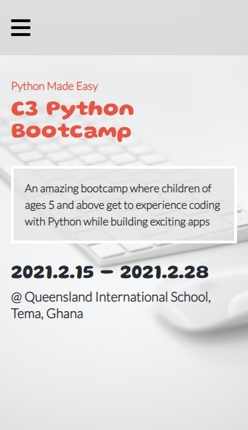

# Python Bootcamp

> A page displaying a python bootcamp; its details, programs outline, time and instructors.

###ScreenShots





## Built With

- HTML, JavaScript, CSS
- No Frameworks Used
- Tools used - Git(version control), WebHint(linting tool), Stylelint(style linting), ESLint(Javascript linting)

## Live Demo

[Live Demo Link](https://livedemo.com)


## Getting Started

**To get a local copy up and running follow these simple example steps.**

### Prerequisites
- A text editor(preferably Visual Studio Code)

### Install
-  [Git](https://git-scm.com/downloads)
-  [Node](https://nodejs.org/en/download/)

### Usage
- Clone the repository using  ```git clone https://github.com/RayhanTabase/Python-Bootcamp-Mock-Page.git```
-  cd into the project folder
-  Run npm install

## Authors

👤 **Salim Abdulai**

- GitHub: [@githubhandle](https://github.com/githubhandle)
- Twitter: [@twitterhandle](https://twitter.com/twitterhandle)
- LinkedIn: [LinkedIn](https://linkedin.com/in/linkedinhandle)

## 🤝 Contributing

Contributions, issues, and feature requests are welcome!

Feel free to check the [issues page](../../issues/).

## Show your support

Give a ⭐️ if you like this project!

## Acknowledgments

- UI Design Credits:  [Cindy Shin in Behance](https://www.behance.net/adagio07)
- Images source: [Unsplash](https://unsplash.com) 

## 📝 License

This project is [MIT](./MIT.md) licensed.
